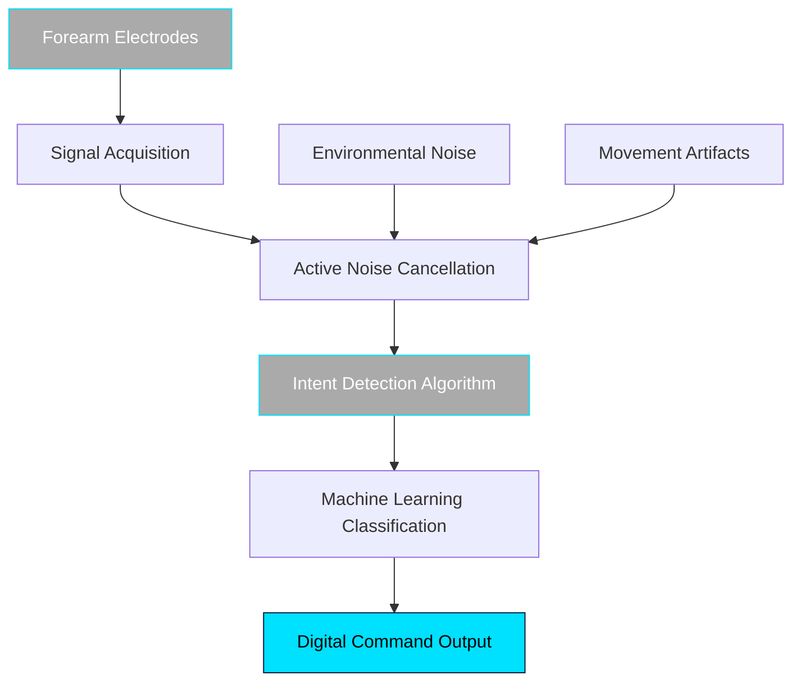

# Pioneering the Future of Human-Machine Interfaces

Neurality Solutions is at the forefront of biosignal interface technology, developing revolutionary systems that bridge the gap between human intent and digital interaction. Our mission is to **accelerate human intent** through breakthrough innovations in neural signal processing and noise cancellation.

## Our Vision

We envision a world where the barrier between thought and action is eliminated, where human intent is seamlessly translated into digital commands with unprecedented speed and precision.

## Technology Flow

Our system processes biosignals through multiple stages to deliver ultra-low latency intent detection:

## Founded on Scientific Excellence

Our team combines decades of research in computational neuroscience, signal processing, and human-computer interaction. We are committed to translating cutting-edge academic research into practical solutions that transform how humans interact with technology.

## Market Opportunity

The global brain-computer interface market is experiencing unprecedented growth, with applications spanning gaming, healthcare, assistive technologies, and spatial computing. Our technology addresses the fundamental limitations of current solutions - latency, noise sensitivity, and limited signal acquisition.

## Competitive Advantage

- **Patent-pending** biosignal active noise cancellation technology
- **Distributed recording** architecture for enhanced signal quality
- **Intent detection** algorithms that predict user actions 50-100ms earlier
- **Real-world robustness** in challenging environments

## Get Involved

We're actively seeking partnerships with technology companies, research institutions, and investors who share our vision of accelerating human intent through advanced biosignal interfaces. 